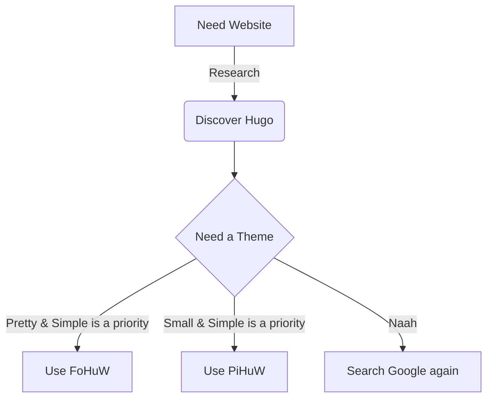



 theme is inspired by [Docsy][1] and uses [Fomantic-ui][3] for look
and feel without too much re-engineering.

In  various wrapped versions of the fomantic components have been created and, in general,
they are implemented as `partials` with a corresponding shortcode `fo t = "thing"` that can be directly used in body text.



## Why ?

Fomantic gives a nice consistent style where the classes are easy to guess. Hugo is fast and generates good, virtually
unhackable static sites.  tries to bring these together.

### Key concepts

1. There is a single shortcode called `fo` for the builtin tools. This makes tools easier to guess.
2. The shortcode uses a consistent set of names for its parameters - this makes them easier to guess.
3. The shortcode does error checking that prints to the preview page AND the log - making errors faster to find
4. A bonus shortcode called `my` allows to you create near-clones of the fohuw tools that you can customize
5. **Resources**
    *  expects images & videos to be Page resources in a page subfolder OR a global resource in the `/assets`
      folder. This allows  to make thumbnails and proxies to improve the responsiveness of the target site.
    * Hugo doesn't know that `.svg` files are images.  has some custom functions to allow you to use
      `image`, `video` and `.svg` resources as   `media`. If something's not working then make sure you're
      using the `media` version of a function.
    *  expects javascript and css to be global resources in the `/assets` folder so that they can be minified
    *  expects data to be a global resource in the `/assets` folder so that pages can be rendered from data
    *  expects blogs and other pages with a feature-image to have a page resource with a name like
      `feature-banana.png`. If that image is in the Page folder, then that's all you need to do for the feature image
      to behave properly.
    *  expects can have other assets that act as a feature image, but also have other actions. This is done
      by having frontmatter `params.src: source-vieo.mp4` to override the feature image.
6. **Customization**
  * `/assets/my/site.css` will automatically be included - put your custom css overrides there

## Project README 



## Folder Organisation

The rough directory structure (try `bash tree` from a terminal) is:

```sh
├── assets
│  │   └── releases.yaml   # release history for your site
  ├── data
│  │   └── releases.yaml   # release history for your site
│   ├── fohuw
│   │   └──      # all the published fohuw specific js, css, logos etc
│   ├── inc
│   │   └──      # markdown files that are included elsewhere (snippets & features)
│   ├── scss
│   │   └──      # @TODO - put the fomantic build environment here
├── config
│   └── _default
│       ├── hugo.yaml   # hugo build and site control
│       ├── module.yaml # module control
│       └── params.yaml # .Site.Params
├── i18n
│   └──                 # @TODO internationalization (Docsy originated)
├── layouts
│   ├── 404.html        # error page
│   ├── blog
│   │   └──             # type="blog" templates
│   ├── community
│   │   └──             # type="community" templates
│   ├── _default
│   │   └──             # default templates
│   ├── docs
│   │   └──             # type="docs" templates - for technical documentation
│   ├── faq
│   │   └──             # type="faq" templates - rename to "iframe"
│   ├── home.html       # home page
│   ├── partials
│   │   ├── dbg
│   │   │   └──         # some debug partials for when your brain hurts
│   │   ├── fo
│   │   │   └──         # fomantic wrappers
│   │   ├── hooks
│   │   │   └──         # hooks for site specific overrides
│   │   ├── my
│   │   │   └──         # partialsthat are site specific
│   │   └──             # Docsy partials updated to use fomantic
│   ├── shortcodes
│   │   ├── fo.html      # all the fomantic shortcode of different types
│   │   ├── fohuw.html   # style FoHuW text
│   │   └──              # Docsy shortcodes updated to use fomantic
│   ├── swagger
│   │   └──              # swagger partials from Docsy
├── LICENSE
├── package.json         # @TODO - update for fomantic sass build
├── postcss.config.js    # @TODO - update for fomantic sass build
├── README.md
├── static
│       └──              # @TODO - update & remove legacy cruft
└── theme.toml           # @TODO - update for clean install
```

[1]: https://www.docsy.dev/
[2]: https://kit.svelte.dev/
[3]: https://fomantic-ui.com/
